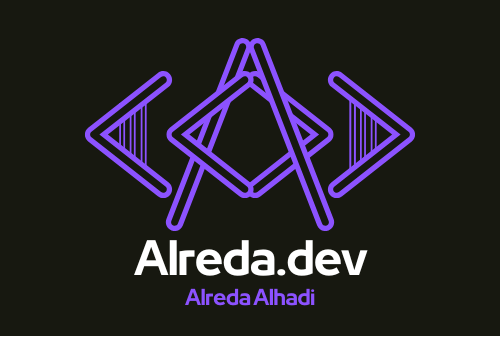
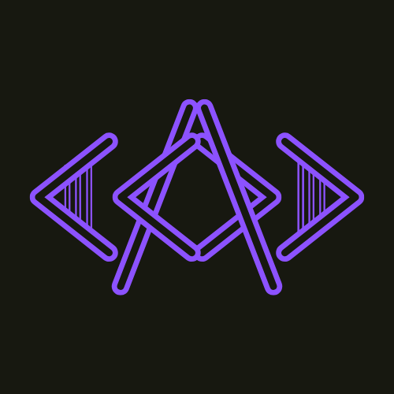

# Personal Portfolio

Welcome to my personal portfolio website! This project showcases my skills, projects, and experience as a Computer Science student and developer.

## 🚀 Features

- **Responsive Design**: Fully responsive and optimized for all devices.
- **Modern Tech Stack**: Built with Next.js, React, and Tailwind CSS.
- **Smooth Navigation**: Includes a sticky navbar with a burger menu for mobile users.
- **SEO Optimized**: Meta tags and Open Graph support for better visibility.
- **Projects Showcase**: Highlights my key projects with descriptions and technologies used.
- **Downloadable Resume**: Easily accessible resume for potential employers.
- **Contact Section**: Links to email, LinkedIn, and resume download.

## 🛠️ Tech Stack

- **Frontend**: React.js, Next.js, Tailwind CSS
- **Hosting**: Vercel
- **Other Tools**: GitHub, Figma

## 📂 Project Structure

```
personal-portfolio/
├── public/               # Static assets (images, icons, resume)
├── src/
│   ├── components/       # Reusable React components
│   ├── pages/            # Next.js pages
│   ├── styles/           # Global styles (Tailwind CSS)
├── .gitignore            # Ignored files for Git
├── next.config.ts        # Next.js configuration
├── tsconfig.json         # TypeScript configuration
├── package.json          # Project dependencies and scripts
```

## 📸 Screenshots

### Home Page


### Projects Section


## 🧑‍💻 Getting Started

To run this project locally, follow these steps:

### Prerequisites

- Node.js (v18 or higher)
- npm

### Installation

1. Clone the repository:
   ```bash
   git clone https://github.com/AlredaAlhadi/personal-portfolio.git
   cd personal-portfolio
   ```

2. Install dependencies:
   ```bash
   npm install
   ```

3. Run the development server:
   ```bash
   npm run dev
   ```

4. Open [http://localhost:3000](http://localhost:3000) in your browser to view the site.

## 🌐 Live Demo

Check out the live version of the portfolio here: [https://alreda.dev](https://alreda.dev)

## 🤝 Connect with Me

- **Email**: [alreda1alhadi@gmail.com](mailto:alreda1alhadi@gmail.com)
- **LinkedIn**: [linkedin.com/in/alreda-alhadi](https://www.linkedin.com/in/alreda-alhadi)
- **Resume**: [Download Resume](public/Resume.pdf)

---

Built with ❤️ using [Next.js](https://nextjs.org), [React](https://reactjs.org), and [Tailwind CSS](https://tailwindcss.com).